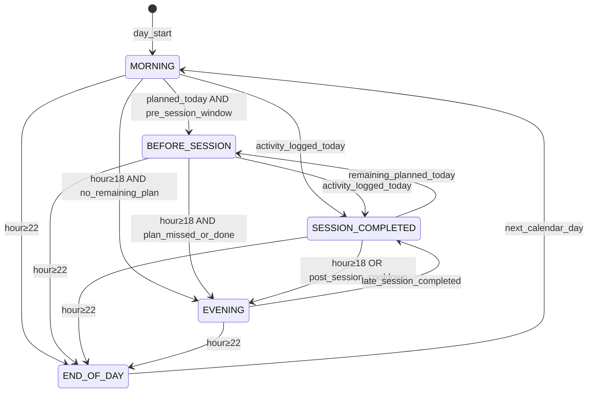

# Context-Aware Today — Daily Phase

> **Milestone:** Product Sprint 3  
> **Status:** Implemented (Phases A–F)  
> **Module:** `src/lib/daily-phase/` · Snapshot `dailyPhase` + `phaseNarrative`  
> **Machine:** athlete-centric — session status → athlete state → time (fallback only)
> **Related:** [`RICH_TODAY.md`](RICH_TODAY.md) · [`ATHLETE_SNAPSHOT.md`](ATHLETE_SNAPSHOT.md) · [`SNAPSHOT_QUALITY_V1_AUDIT.md`](SNAPSHOT_QUALITY_V1_AUDIT.md)

---

## 1. Problem

Rich Today answers five athlete questions in a **static** order. The hero always asks _« Peux-tu t'entraîner fort aujourd'hui ? »_ — even after the athlete has already trained.

The briefing layer (`briefing-phase.ts`) is **clock-only** (morning / midday / afternoon / evening). It ignores whether a session is planned, completed, or still upcoming.

`today-narrative-context.ts` already contains session-aware copy logic, but it is **not first-class**: it lives in a deprecated narrative header path and is not persisted in the Athlete Snapshot.

**Goal:** Today becomes a **companion that evolves throughout the day** — same layout (Rich Today), different narrative per moment.

**Constraints (non-negotiable):**

- No UI redesign — adapt copy, hero eyebrow, product message, recommendation framing, briefing phase.
- No new physiological models — reuse `reasoning`, `recovery`, `fatigue`, `adaptation`, `dailyStrain`, `freshness`.
- Single source of truth — **Daily Phase is computed at snapshot build time** and stored on `AthleteSnapshot`.

---

## 2. Product concept — Daily Phase

A **Daily Phase** is the athlete's position in their training day — not just the clock.

| Phase               | Athlete moment                               | Primary question                                       |
| ------------------- | -------------------------------------------- | ------------------------------------------------------ |
| `MORNING`           | Day not yet shaped by training               | **Qu'est-ce qui compte aujourd'hui ?**                 |
| `BEFORE_SESSION`    | Planned session today, not yet done          | **Comment aborder la séance d'aujourd'hui ?**          |
| `SESSION_COMPLETED` | Session just logged (accomplishment debrief) | **Qu'a accompli l'entraînement d'aujourd'hui ?**       |
| `RECOVERY_WINDOW`   | Post-session adaptation window               | **Que faire maintenant pour maximiser l'adaptation ?** |
| `END_OF_DAY`        | Day wrap-up — impact on tomorrow             | **Comment aujourd'hui change-t-il demain ?**           |

### Priority order

1. **Session status** — planned / completed / none / remaining
2. **Athlete state** — new session, strain available, inference updated, sleep logged, prior phase
3. **Time** — fallback only (`22:00`, late-day post-training) when signals cannot disambiguate

**No hard `18:00 → Evening`.** Rest days evolve from `MORNING` → `RECOVERY_WINDOW` when inference/recommendation is ready, not when the clock hits 18:00.

### Anti-patterns (explicit product rules)

| Never                                                              | Instead                                 |
| ------------------------------------------------------------------ | --------------------------------------- |
| Ask _« Peux-tu t'entraîner fort ? »_ after today's session is done | Switch to `SESSION_COMPLETED` narrative |
| Congratulate for completing a session not yet done                 | Stay in `BEFORE_SESSION` or `MORNING`   |
| Present morning verdict as evening advice                          | Re-frame via `EVENING` / `END_OF_DAY`   |
| Invent post-session load before `dailyStrain` is fresh             | Acknowledge pending sync (freshness)    |

---

## 3. Input signals

Daily Phase resolution uses **only signals already available** at snapshot build time.

### 3.1 Calendar & clock

| Signal          | Source                                     | Notes                            |
| --------------- | ------------------------------------------ | -------------------------------- |
| `localHour`     | `refDate.getHours()` (athlete TZ — see §7) | Soft boundaries, not sole driver |
| `trainingDayId` | Snapshot key `YYYY-MM-DD`                  | Resets phase at day boundary     |

### 3.2 Session state (planning + activities)

| Signal                  | Source                                              | Notes                                          |
| ----------------------- | --------------------------------------------------- | ---------------------------------------------- |
| `completedSessionCount` | Activities where `isSameDay(date, today)`           | From `buildTodayDaySummary` inputs             |
| `plannedSessionCount`   | Planned sessions today, `!completed && !activityId` | Same                                           |
| `remainingPlannedCount` | Planned not yet linked to activity                  | Drives `BEFORE_SESSION` vs `SESSION_COMPLETED` |
| `nextPlannedStartAt`    | `plannedSession.startTime` on earliest remaining    | Optional — enables pre-session window          |
| `lastActivityAt`        | Max `activity.date` today                           | Post-session cooldown                          |
| `daySummaryKind`        | `done` / `planned` / `empty`                        | Mirrors `TodayDaySummary`                      |

### 3.3 Observations & freshness

| Signal                        | Source                                              | Notes                             |
| ----------------------------- | --------------------------------------------------- | --------------------------------- |
| `latestSessionObservationAt`  | `freshness` / Prisma `SESSION` observation          | New activity landed               |
| `dailyStrainAvailable`        | `dailyStrain.available`                             | Post-session strain credible      |
| `reasoningStale`              | `freshness.domains.reasoning`                       | Re-inference pending              |
| `newSessionSinceLastSnapshot` | `latestSessionObservationAt > snapshot.generatedAt` | Triggers regen + phase transition |

### 3.4 Physiological state (existing inference)

| Signal                       | Source                     | Role in phase           |
| ---------------------------- | -------------------------- | ----------------------- |
| `overallVerdict`             | `reasoning.overallVerdict` | Headline tone per phase |
| `topAction`                  | `reasoning.topAction`      | Action line             |
| `readinessScore`             | `recovery.readinessScore`  | Morning / tomorrow prep |
| `dailyStrain.strainScore`    | `dailyStrain`              | Post-session review     |
| `adaptation.adaptationTrend` | `adaptation`               | Evening trajectory      |
| `adviceActionable`           | Truthfulness overlay       | Gate strong claims      |

### 3.5 Upcoming sessions

| Signal                | Source                               | Role                            |
| --------------------- | ------------------------------------ | ------------------------------- |
| `hasSessionTomorrow`  | Planned sessions `trainingDayId + 1` | Evening copy                    |
| `upcomingRaceContext` | `coach-context` (existing)           | Optional framing — no new model |

---

## 4. State machine

### 4.1 Design choice — derived state, event-driven transitions

Daily Phase is a **pure function** of inputs at time `T`:

```
resolveDailyPhase(input, refDate) → DailyPhase
```

There is no persisted FSM memory across days. Within a day, **transitions** are observed when snapshot inputs change (new session, time bucket shift, planning update).



### 4.2 Resolution algorithm (priority order)

Evaluate **top-down**; first match wins.

```
function resolveDailyPhase(input, refDate):

  hour = localHour(refDate)
  done = completedSessionCount > 0
  remaining = remainingPlannedCount > 0
  planned = plannedSessionCount > 0

  // 1. Day boundary tail
  if hour >= 22:
    return END_OF_DAY

  // 2. Post-session dominates midday (even if clock says "morning" in edge TZ cases)
  if done AND NOT remaining:
    if hour >= 18:
      return EVENING
    if minutesSince(lastActivityAt) >= 90 OR dailyStrainAvailable:
      return SESSION_COMPLETED  // may still be afternoon
    return SESSION_COMPLETED

  // 3. Done today but more planned (brick, double day)
  if done AND remaining:
    if isPreSessionWindow(input, refDate):
      return BEFORE_SESSION
    return SESSION_COMPLETED  // debrief last done; next session noted in action row

  // 4. Planned, not done
  if planned AND NOT done:
    if isPreSessionWindow(input, refDate) OR hour >= 15:
      return BEFORE_SESSION
    return MORNING  // early day, session later

  // 5. No plan, no done
  if hour >= 18:
    return EVENING
  if hour >= 12 AND NOT planned:
    return MORNING  // rest day afternoon still "what to do" unless evening

  return MORNING
```

### 4.3 Helper — `isPreSessionWindow`

```
function isPreSessionWindow(input, refDate):
  if nextPlannedStartAt is null:
    return localHour >= 14 AND plannedToday   // afternoon session, no exact time
  start = parse(nextPlannedStartAt on trainingDayId)
  return refDate >= start - 3h AND refDate < start + 30min
```

### 4.4 Transition rules (snapshot regeneration)

| Event                                   | Phase change                                                | Snapshot action                          |
| --------------------------------------- | ----------------------------------------------------------- | ---------------------------------------- |
| New `SESSION` observation               | → `SESSION_COMPLETED` (or `BEFORE_SESSION` if more planned) | Regenerate inference + snapshot          |
| `dailyStrain` becomes available         | Refine `SESSION_COMPLETED` copy                             | Regenerate if fingerprint changes        |
| Planned session added/removed           | `MORNING` ↔ `BEFORE_SESSION`                                | Regenerate on planning domain stale      |
| Clock crosses 18:00 / 22:00             | `EVENING` / `END_OF_DAY`                                    | Lazy regen on next read (see §7.3)       |
| Briefing generated for new phase bucket | Briefing content refresh                                    | `regenerateAthleteSnapshotAfterBriefing` |
| New calendar day                        | Reset → `MORNING`                                           | New `trainingDayId` row                  |

**Fingerprint extension:** include `dailyPhase.phase` + `completedSessionCount` + `remainingPlannedCount` in `computeSnapshotId` so phase-only changes do not spuriously skip regen when narrative must update.

---

## 5. Phase → product surface mapping

Same Rich Today components — **different content selectors**.

### 5.1 Hero (`TodayVerdictHero`)

| Phase               | Eyebrow (replaces static question) | Headline source                              | Subline source                                            |
| ------------------- | ---------------------------------- | -------------------------------------------- | --------------------------------------------------------- |
| `MORNING`           | Que faire aujourd'hui ?            | `mapVerdictToDisplay(verdict)` if actionable | `canTrainHardAnswer`                                      |
| `BEFORE_SESSION`    | Avant ta séance                    | Verdict framed for execution                 | `buildPreSessionMessage` (from `today-narrative-context`) |
| `SESSION_COMPLETED` | Séance faite                       | `mapContextualNarrativeDisplay` label        | `buildPostSessionMessage`                                 |
| `EVENING`           | Ce soir                            | Recovery / tomorrow readiness                | `buildEveningPrepMessage` (new, deterministic)            |
| `END_OF_DAY`        | Fin de journée                     | Day recap one-liner                          | Strain summary or rest acknowledgement                    |

When `!adviceActionable` → all phases use truthfulness copy (unchanged Sprint 1 behaviour).

### 5.2 Product message (`primaryProductMessage`)

Phase-specific **override layer** in `snapshot-builder` (after freshness, before truthfulness):

| Phase               | `primaryProductMessage` intent                     |
| ------------------- | -------------------------------------------------- |
| `MORNING`           | Freshness / baseline pending (existing)            |
| `BEFORE_SESSION`    | « Séance prévue — [sport]. Readiness [X]. »        |
| `SESSION_COMPLETED` | « [Sport] · [TSS] TSS. Strain [score] si dispo. »  |
| `EVENING`           | « Récupération en cours — demain [verdict hint]. » |
| `END_OF_DAY`        | « Journée [légère/modérée/chargée] — [N] TSS. »    |

Falls back to `freshness.primaryProductMessage` when phase message cannot be built honestly.

### 5.3 Recommendation (`recommendation`)

No new engine — **re-frame** existing `pickRecommendation` result:

| Phase                        | Framing                                                               |
| ---------------------------- | --------------------------------------------------------------------- |
| `MORNING` / `BEFORE_SESSION` | Forward-looking (`topAction`, domain recommendation)                  |
| `SESSION_COMPLETED`          | Recovery / cooldown recommendation (`recovery` or `fatigue` priority) |
| `EVENING` / `END_OF_DAY`     | Sleep / recovery domain recommendation                                |

Use `reasoning.systemAttentionPriority` unchanged; only **presentation verb** changes (e.g. « Ce soir » vs « Aujourd'hui »).

### 5.4 Briefing (`briefing`)

Align `resolveBriefingPhase` with Daily Phase:

| Daily Phase         | Briefing system prompt bucket |
| ------------------- | ----------------------------- |
| `MORNING`           | `morning`                     |
| `BEFORE_SESSION`    | `midday` (pre-effort)         |
| `SESSION_COMPLETED` | `afternoon` (debrief)         |
| `EVENING`           | `evening`                     |
| `END_OF_DAY`        | `evening`                     |

Pass `DailyPhase` into `buildBriefingDayContext` so validation rules (`briefing-validation.ts`) continue to forbid temporal lies.

### 5.5 Why block (`TodayWhyBlock`)

| Phase               | `whyFocus`       | Content priority                         |
| ------------------- | ---------------- | ---------------------------------------- |
| `MORNING`           | `readiness`      | `keyFindings` (recovery/sleep)           |
| `BEFORE_SESSION`    | `session_prep`   | Findings + planned session context       |
| `SESSION_COMPLETED` | `session_review` | Strain + fatigue findings                |
| `EVENING`           | `tomorrow_prep`  | Recovery trend + limiting factor         |
| `END_OF_DAY`        | `day_recap`      | Briefing excerpt or adaptation one-liner |

### 5.6 Action row (`TodayActionRow`)

| Phase               | Left column (limiting)       | Right column (action)              |
| ------------------- | ---------------------------- | ---------------------------------- |
| `MORNING`           | Unchanged                    | Planned sessions                   |
| `BEFORE_SESSION`    | Unchanged                    | Emphasize planned session          |
| `SESSION_COMPLETED` | Post-session limiting factor | Done sessions + remaining plan     |
| `EVENING`           | Tomorrow limiter             | « Demain » preview (link planning) |
| `END_OF_DAY`        | Hidden or merged into recap  | Rest / sleep cue                   |

### 5.7 Weekly trajectory (`TodayWeeklyTrajectory`)

Unchanged data; **eyebrow only**:

- `MORNING` / `BEFORE_SESSION` → _Est-ce que je progresse ?_
- `SESSION_COMPLETED` → _Impact sur la semaine_
- `EVENING` / `END_OF_DAY` → _Tendance avant demain_

---

## 6. Athlete Snapshot additions

### 6.1 New types (`src/core/athlete-state/snapshot.ts`)

```typescript
export type DailyPhase =
  'MORNING' | 'BEFORE_SESSION' | 'SESSION_COMPLETED' | 'EVENING' | 'END_OF_DAY';

export type DailyPhaseSignals = {
  localHour: number;
  completedSessionCount: number;
  plannedSessionCount: number;
  remainingPlannedCount: number;
  lastActivityAt: string | null;
  nextPlannedStartAt: string | null;
  dailyStrainAvailable: boolean;
  newSessionSincePriorGeneration: boolean;
};

export type DailyPhaseContext = {
  phase: DailyPhase;
  phaseLabel: string; // athlete-facing, e.g. "Avant ta séance"
  primaryQuestion: string; // hero eyebrow
  computedAt: string;
  signals: DailyPhaseSignals;
};

export type PhaseNarrative = {
  heroHeadline: string;
  heroSubline: string;
  productMessage: string | null;
  whyFocus: 'readiness' | 'session_prep' | 'session_review' | 'tomorrow_prep' | 'day_recap';
  briefingPhase: 'morning' | 'midday' | 'afternoon' | 'evening';
};
```

### 6.2 New snapshot fields

```typescript
export type AthleteSnapshot = {
  // ... existing fields ...
  dailyPhase: DailyPhaseContext;
  phaseNarrative: PhaseNarrative;
};
```

### 6.3 Builder input extension

```typescript
export type SnapshotBuildInput = {
  // ... existing ...
  dayContext: DailyPhaseDayContext; // activities + planned sessions for trainingDayId
};
```

`DailyPhaseDayContext` is a **slim DTO** (counts, timestamps, labels) — not a new data plane. Populated in `snapshot-service` from the same queries as `buildBriefingDayContext`.

### 6.4 Fingerprint update

Add to `computeSnapshotId`:

```
dailyPhase.phase
dayContext.completedSessionCount
dayContext.remainingPlannedCount
dayContext.lastActivityAt
```

### 6.5 Persistence

`AthleteSnapshotRecord.payload` is JSON — **no Prisma migration required**. Older snapshots without `dailyPhase` → client/server fallback: compute phase on read once, then regen.

### 6.6 Truthfulness interaction

`adviceActionable` gates **forward training advice** only in `MORNING` and `BEFORE_SESSION`. In `SESSION_COMPLETED` / `EVENING` / `END_OF_DAY`, retrospective statements (session done, TSS logged) do not require training verdict confidence.

Add to `snapshot-truthfulness.ts`:

```typescript
export function isForwardAdvicePhase(phase: DailyPhase): boolean {
  return phase === 'MORNING' || phase === 'BEFORE_SESSION';
}
```

---

## 7. Implementation plan

### Phase A — Core (pure, tested)

| Step | File                                              | Work                                                                    |
| ---- | ------------------------------------------------- | ----------------------------------------------------------------------- |
| A1   | `src/lib/daily-phase/types.ts`                    | `DailyPhase`, signals, labels                                           |
| A2   | `src/lib/daily-phase/resolve.ts`                  | `resolveDailyPhase`, `isPreSessionWindow`                               |
| A3   | `src/lib/daily-phase/narrative.ts`                | `buildPhaseNarrative` — maps phase + snapshot fields → `PhaseNarrative` |
| A4   | `src/lib/daily-phase/__tests__/resolve.test.ts`   | Transition table tests (≥20 scenarios)                                  |
| A5   | `src/lib/daily-phase/__tests__/narrative.test.ts` | No post-session training question, no false congratulations             |

Reuse and **migrate** logic from `today-narrative-context.ts` into `daily-phase/narrative.ts`; deprecate duplicate paths.

### Phase B — Snapshot pipeline

| Step | File                                 | Work                                                                     |
| ---- | ------------------------------------ | ------------------------------------------------------------------------ |
| B1   | `src/lib/daily-phase/day-context.ts` | `buildDailyPhaseDayContext` (client + server safe)                       |
| B2   | `snapshot-builder.ts`                | Accept `dayContext`, emit `dailyPhase` + `phaseNarrative`                |
| B3   | `snapshot-service.ts`                | Load activities + planned sessions; pass `dayContext`                    |
| B4   | `snapshot.ts`                        | Type extensions                                                          |
| B5   | `snapshot-truthfulness.ts`           | `isForwardAdvicePhase`                                                   |
| B6   | Orchestrator hook                    | Regen snapshot when `SESSION` observation inserted (existing event path) |

### Phase C — Briefing alignment

| Step | File                     | Work                                         |
| ---- | ------------------------ | -------------------------------------------- |
| C1   | `briefing-phase.ts`      | Export `mapDailyPhaseToBriefingPhase`        |
| C2   | `daily-briefing.ts`      | Use mapped phase for system prompt           |
| C3   | `briefing-context.ts`    | Include `dailyPhase` in `BriefingDayContext` |
| C4   | `briefing-validation.ts` | Phase-aware validation rules                 |

### Phase D — Today UI (copy only, no layout)

| Step | File                                | Work                                                             |
| ---- | ----------------------------------- | ---------------------------------------------------------------- |
| D1   | `today-rich-view.ts`                | Accept `phaseNarrative` / `dailyPhase`; phase-aware hero strings |
| D2   | `today-verdict-hero.tsx`            | Eyebrow + headline from snapshot, not hardcoded                  |
| D3   | `today-why-block.tsx`               | `whyFocus` selector                                              |
| D4   | `today-action-row.tsx`              | Phase-aware section labels                                       |
| D5   | `today-weekly-trajectory.tsx`       | Phase-aware eyebrow                                              |
| D6   | `use-today-dashboard-view-model.ts` | Expose `dailyPhase`, `phaseNarrative` from snapshot              |

### Phase E — Time drift without new observations

| Step | Work                                                                                                                                                    |
| ---- | ------------------------------------------------------------------------------------------------------------------------------------------------------- |
| E1   | On `useAthleteSnapshot` poll tick, if `localHour` crossed boundary (18, 22) and `dailyPhase` stale > 1h, trigger soft `POST /api/athlete-state/refresh` |
| E2   | Optional Vercel cron `0 18,22 * * *` — regen snapshot for active athletes (low priority)                                                                |

### Phase F — Documentation & QA

| Step | Work                                                                                                          |
| ---- | ------------------------------------------------------------------------------------------------------------- |
| F1   | Update `ATHLETE_SNAPSHOT.md` field table                                                                      |
| F2   | Update `RICH_TODAY.md` — questions become phase-conditional                                                   |
| F3   | Manual QA script: morning rest day, morning with PM plan, pre-session, post-run, double session, evening rest |

---

## 8. Reuse map (existing code)

| Existing module              | Role in Daily Phase                                               |
| ---------------------------- | ----------------------------------------------------------------- |
| `briefing-phase.ts`          | Clock buckets → briefing LLM prompts                              |
| `briefing-context.ts`        | Session lists for validation                                      |
| `today-narrative-context.ts` | Pre/post session messages → migrate to `daily-phase/narrative.ts` |
| `today-day-summary.ts`       | UI session lines (unchanged)                                      |
| `freshness-service.ts`       | `newSessionSincePriorGeneration`                                  |
| `snapshot-truthfulness.ts`   | Forward vs retrospective advice gating                            |

---

## 9. Example scenarios

### Scenario A — Morning, session planned 18:00

```
07:30 → MORNING
        Hero: "Que faire aujourd'hui ?" / verdict TRAIN_HARD
        Action row: Vélo prévu 18:00

15:00 → BEFORE_SESSION
        Hero: "Avant ta séance" / "Vélo au programme ce soir"
        Why: session_prep findings

19:30 → SESSION_COMPLETED (after activity sync)
        Hero: "Séance faite" / "Vélo fait — soirée calme"
        Never: "Peux-tu t'entraîner fort ?"

21:00 → EVENING
        Hero: "Comment préparer demain ?"
        Why: tomorrow_prep (HRV trend, sleep)
```

### Scenario B — Rest day

```
08:00 → MORNING — verdict RECOVER, no plan
20:00 → EVENING — "Repos — prépare demain" (readiness for tomorrow)
22:30 → END_OF_DAY — day recap, no false session praise
```

### Scenario C — Double session (morning run + evening gym)

```
10:00 → SESSION_COMPLETED (run done, gym remaining)
15:00 → BEFORE_SESSION (gym tonight)
21:00 → SESSION_COMPLETED → EVENING after second done
```

---

## 10. Success criteria

1. Hero eyebrow **never** asks a forward training question after all planned work is done.
2. Hero **never** shows "Séance faite" without `completedSessionCount > 0`.
3. `dailyPhase` is present on every new snapshot and drives hero + product message.
4. Briefing validation pass rate unchanged or improved (temporal rules enforced).
5. Rich Today layout unchanged — only text and content selection adapt.
6. Zero new inference models; `resolveDailyPhase` is fully unit-tested.

---

## 11. Out of scope (this milestone)

- Push notifications per phase
- Athlete timezone preference UI (use browser TZ initially; server uses `trainingDayId` + activity timestamps)
- New drill-down pages
- LLM-generated phase narrative (deterministic only for V1)
