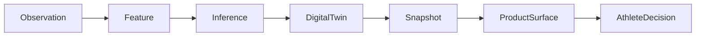

# Product Data Expression Matrix

## Purpose

This document audits how SHARPIT's existing intelligence is expressed to the athlete today.

For every relevant datum, it answers:

- Is it visible to the athlete?
- If yes, where?
- If not, why?
- Which athlete decision could it improve?
- Should it be `promoted`, `summarized`, `hidden`, or `removed`?

The guiding rule is:

No chain should stop before the athlete unless the datum is intentionally internal.

## Expression statuses

- `promoted`: deserves explicit athlete-facing expression
- `summarized`: useful, but should be translated into a simpler athlete-facing understanding
- `hidden`: needed for trust, confidence, audit or internal computation, not for direct display
- `removed`: currently adds no athlete decision value and should disappear from product surfaces

## 1. Feature audit

### Session features

- `tssScore` — visible: indirectly in Effort and load analytics; why not direct: raw stress number alone is not enough; decision: how costly today's work was; status: `summarized`.
- `tssMethod` — visible: no; why not: method provenance is technical; decision: trust in stress estimate; status: `hidden`.
- `intensityFactor` — visible: mostly outside Today, in activity-level analysis; decision: judge whether the session was threshold / sub-threshold / too hard; status: `summarized`.
- `aerobicLoadFactor` — visible: no; why not: computed but not narrated; decision: whether the day built base durability or mostly consumed high cost; status: `promoted`.
- `anaerobicLoadFactor` — visible: indirect only through fatigue; decision: whether the day created a high metabolic cost; status: `promoted`.
- `timeInZones` — visible: no; why not: feature exists but no athlete-facing synthesis; decision: understand distribution of effort and pacing discipline; status: `promoted`.
- `hrDriftPercent` — visible: not on Today pages; decision: judge durability / decoupling and whether aerobic system held; status: `promoted`.
- `mechanicalLoad` — visible: no; why not: isolated kJ without context is weak product language; decision: little direct value outside advanced performance analysis; status: `hidden`.
- `elevationStressScore` — visible: no; why not: score is internal and unexplained; decision: understand why a session cost more than duration suggested; status: `summarized`.
- `efficiencyFactor` — visible: only in activity analytics outside Today; decision: detect whether same effort produced better output; status: `summarized`.
- `paceVariabilityIndex` — visible: no; decision: understand steadiness vs wasted variability; status: `promoted`.
- `subjectiveRpe` — visible: not directly; decision: compare felt cost vs expected load; status: `summarized`.
- `sourceProvidedTss` — visible: no; why not: audit-only cross-check; decision: none for athlete; status: `hidden`.
- `confidence` — visible: only indirectly via page-level confidence; decision: trust the session interpretation; status: `summarized`.
- `algorithmId` — visible: no; decision: none; status: `hidden`.
- `sourceObsIds` — visible: no; decision: none; status: `hidden`.

### Load features

- `acuteLoad` — visible: indirectly via TSS 7j and fatigue context; decision: increase / hold / reduce this week; status: `summarized`.
- `chronicLoad` — visible: no direct athlete surface; decision: understand base capacity versus current demand; status: `summarized`.
- `acwr` — visible: yes on Effort page; decision: avoid sudden load spikes; status: `summarized`.
- `weeklyLoad` — visible: yes; decision: dose the current week; status: `summarized`.
- `loadMonotony` — visible: no; decision: judge whether training variety is too low; status: `promoted`.
- `loadStrain` — visible: no; decision: understand combined volume x monotony burden; status: `summarized`.
- `trainingFrequency` — visible: no; decision: choose between another session and a rest day; status: `summarized`.
- `restDayCount` — visible: no; decision: verify whether recovery rhythm exists; status: `summarized`.
- `acuteChronicLoadTrend` — visible: no; decision: distinguish progressive build from abrupt escalation; status: `promoted`.
- `acuteLoadRun` — visible: no; decision: protect run-specific tissues and progression; status: `summarized`.
- `acuteLoadBike` — visible: no; decision: separate bike fatigue from global fatigue; status: `summarized`.
- `chronicLoadRun` — visible: no; decision: judge run robustness before adding run stress; status: `summarized`.
- `chronicLoadBike` — visible: no; decision: judge bike robustness before adding bike stress; status: `summarized`.
- `confidence` — visible: only page-level; decision: trust load interpretation; status: `hidden`.
- `algorithmId` — visible: no; status: `hidden`.
- `sourceObsIds` — visible: no; status: `hidden`.

### Recovery features

- `sleepEfficiencyPercent` — visible: indirectly through Sleep and Recovery surfaces; decision: whether time in bed translated into real recovery; status: `summarized`.
- `sleepDebtMin` — visible: not as canonical feature; decision: adjust today's charge and tonight's behavior; status: `promoted`.
- `sleepOnsetConsistencyMin` — visible: no; decision: improve schedule regularity and downstream recovery; status: `promoted`.
- `sleepDurationTrend` — visible: no canonical expression; decision: detect multi-day drift before readiness drops; status: `promoted`.
- `hrvAbsolute` — visible: yes in Recovery stats; decision: trend awareness and readiness trust; status: `summarized`.
- `hrvDeltaFromBaseline` — visible: indirectly; decision: judge whether autonomic state is better or worse than normal; status: `promoted`.
- `hrvCoefficientOfVariation` — visible: no; decision: detect instability even when absolute HRV looks normal; status: `promoted`.
- `rhrAbsolute` — visible: yes in Recovery stats; decision: recovery trust; status: `summarized`.
- `rhrDeltaFromBaseline` — visible: not explicitly; decision: see whether body is compensating or under strain; status: `promoted`.
- `subjectiveWellnessIndex` — visible: partly via Recovery labels; decision: reconcile felt state with physiology; status: `summarized`.
- `subjectiveWellnessComponents` — visible: not directly; decision: know whether mood, energy or soreness drives the problem; status: `promoted`.
- `rpeVsTargetZone` — visible: no; decision: see whether usual sessions feel harder than they should; status: `promoted`.
- `confidence` — visible: only summarized; decision: trust recovery reading; status: `summarized`.
- `algorithmId` — visible: no; status: `hidden`.
- `sourceObsIds` — visible: no; status: `hidden`.

### Body features

- `weightKg` — visible: yes in Body; decision: watch trajectory rather than single weigh-ins; status: `summarized`.
- `fatPercent` — visible: yes in Body; decision: composition trajectory; status: `summarized`.
- `fatMassKg` — visible: no; decision: distinguish lighter-from-leaner versus lighter-from-losing muscle; status: `promoted`.
- `leanMassKg` — visible: no; decision: detect whether the athlete preserves useful mass while cutting; status: `promoted`.
- `musclePercent` — visible: yes in Body; decision: understand whether the trajectory preserves performance support; status: `summarized`.
- `waterPercent` — visible: yes in Body, but as a raw metric; decision: understand whether today's measure is dehydrated/noisy versus meaningful; status: `promoted`.
- `visceralFat` — visible: yes in Body; decision: health trajectory and body-composition risk; status: `summarized`.
- `weightTrend7d` — visible: not as a canonical feature; decision: know whether weight is drifting too fast / too slow; status: `promoted`.
- `fatPercentTrend7d` — visible: not as a canonical feature; decision: know whether the athlete is really leaning out; status: `promoted`.
- `confidence` — visible: no; decision: trust body-composition reading; status: `hidden`.
- `algorithmId` — visible: no; status: `hidden`.
- `sourceObsIds` — visible: no; status: `hidden`.

### Condition features

- `activeConditionCount` — visible: only on Physical screen, not in Today; decision: understand global injury burden; status: `summarized`.
- `maxActiveSeverity` — visible: mostly on Physical screen; decision: know whether the biggest limiter should alter training; status: `promoted`.
- `trainingBlockedByCondition` — visible: indirect through fatigue / limitation; decision: modify training capacity today; status: `summarized`.
- `conditionTrend` — visible: no; decision: know whether the issue is improving, stable or worsening; status: `promoted`.
- `confidence` — visible: no; status: `hidden`.
- `algorithmId` — visible: no; status: `hidden`.
- `sourceObsIds` — visible: no; status: `hidden`.

## 2. Digital Twin audit

### Recovery state

- `readinessScore` — visible: yes, dashboard and Recovery; decision: how hard to train; status: `promoted`.
- `readinessCategory` — visible: yes as language layer; decision: rapid comprehension; status: `summarized`.
- `dimensions.autonomic` — visible: yes; decision: whether nervous-system readiness is the limiter; status: `promoted`.
- `dimensions.sleep` — visible: yes; decision: whether the lever is night quality/quantity; status: `promoted`.
- `dimensions.subjective` — visible: partly; decision: whether the body feels worse than objective signals; status: `promoted`.
- `dimensions.loadContext` — visible: partly; decision: whether the issue is accumulated training, not last night's sleep; status: `promoted`.
- `primaryLimitingFactor` — visible: yes; decision: choose the right recovery lever; status: `promoted`.
- `estimatedTimeToFullRecovery` — visible: yes; decision: decide whether to wait, swap or reduce; status: `promoted`.
- `overreachingRisk` — visible: yes; decision: avoid pushing into maladaptation; status: `summarized`.
- `illnessRisk` — visible: yes; decision: be conservative when physiology resembles sickness; status: `summarized`.
- `dissonanceDetected` — visible: yes but still technical; decision: investigate conflicting signals before trusting the day; status: `promoted`.
- `confidence` — visible: yes as confidence; decision: trust or downgrade the recommendation; status: `summarized`.
- `dataCompleteness` — visible: partly via footer; decision: interpret uncertainty; status: `summarized`.
- `modelId` — visible: no; status: `hidden`.
- `computedAt` — visible: no; status: `hidden`.
- `trainingDayId` — visible: indirectly through selected date; status: `hidden`.

### Fatigue state

- `fatigueIndex` — visible: not directly; decision: overall cost interpretation; status: `summarized`.
- `fatigueLevel` — visible: yes; decision: know whether fatigue is fresh/functional/accumulated; status: `summarized`.
- `fatigueType` — visible: yes in Effort hero; decision: understand which system pays the cost; status: `promoted`.
- `dimensions.load` — visible: yes; decision: know whether the issue is pure load burden; status: `promoted`.
- `dimensions.neuromuscular` — visible: yes; decision: know whether the issue is force/speed/power fatigue; status: `promoted`.
- `dimensions.metabolic` — visible: yes; decision: know whether aerobic/anaerobic cost is the limiter; status: `promoted`.
- `dimensions.cumulative` — visible: yes; decision: know whether repeated days matter more than today alone; status: `promoted`.
- `dimensions.psychological` — visible: yes only weakly; decision: detect when mind and energy limit the session more than physiology; status: `promoted`.
- `trajectory` — visible: yes through labels/arrows; decision: know if fatigue is resolving or accelerating; status: `promoted`.
- `consecutiveAccumulationDays` — visible: yes; decision: whether to break the streak; status: `summarized`.
- `dominantDimension` — visible: yes; decision: know what to protect or target; status: `promoted`.
- `primaryLimitingFactor` — visible: yes; decision: choose what to reduce; status: `promoted`.
- `functionalOverreachingRisk` — visible: yes; decision: avoid crossing from productive fatigue into risk; status: `summarized`.
- `estimatedTimeToFresh` — visible: yes; decision: plan next key session; status: `promoted`.
- `performanceImpairmentEstimate` — visible: yes as capacity; decision: know how much output is likely blunted; status: `promoted`.
- `trainingCapacity` — visible: yes; decision: full / reduced / light / rest only; status: `promoted`.
- `confidence` — visible: yes as footer/strip; decision: trust the effort guidance; status: `summarized`.
- `dataCompleteness` — visible: yes as completeness; decision: interpret uncertainty; status: `summarized`.
- `modelId` — visible: no; status: `hidden`.
- `computedAt` — visible: no; status: `hidden`.
- `trainingDayId` — visible: indirect; status: `hidden`.

### Adaptation state

- `adaptationIndex` — visible: yes; decision: understand whether recent work is being absorbed; status: `promoted`.
- `adaptationStatus` — visible: yes; decision: classify current adaptation trajectory; status: `summarized`.
- `adaptationTrend` — visible: yes; decision: progress / maintain / retreat; status: `promoted`.
- `dimensions.loadProgression` — visible: yes; decision: whether load progression itself is the issue; status: `promoted`.
- `dimensions.neuromuscularEfficiency` — visible: yes; decision: whether same effort yields better output; status: `promoted`.
- `dimensions.autonomicAdaptation` — visible: yes; decision: whether the nervous system follows the block; status: `promoted`.
- `dimensions.recoveryQuality` — visible: yes; decision: whether recovery is capping adaptation; status: `promoted`.
- `limitingFactor` — visible: yes; decision: know what is blocking progress; status: `promoted`.
- `estimatedAdaptationPeak` — visible: no; decision: time the best moment in a cycle; status: `promoted`.
- `plateauRisk` — visible: yes; decision: change the stimulus before stagnation; status: `promoted`.
- `overreachingWithoutAdaptationDetected` — visible: yes; decision: stop adding stress without return; status: `promoted`.
- `confidence` — visible: yes; decision: trust or defer adaptation reading; status: `summarized`.
- `dataCompleteness` — visible: partly via history/completeness; decision: interpret uncertainty; status: `summarized`.
- `modelId` — visible: no; status: `hidden`.
- `computedAt` — visible: no; status: `hidden`.
- `trainingDayId` — visible: indirect; status: `hidden`.

### Reasoning state

- `overallVerdict` — visible: yes; decision: train hard / smart / easy / recover / caution; status: `promoted`.
- `systemAttentionPriority` — visible: no; decision: route the athlete to the right dimension first; status: `summarized`.
- `physiologicalConsistency` — visible: partly; decision: judge whether the state is convergent or conflicted; status: `promoted`.
- `consistencyScore` — visible: no numeric surface; decision: trust system alignment; status: `summarized`.
- `keyFindings` — visible: partly through evidence text; decision: understand what matters most; status: `promoted`.
- `limitingFactor.system` — visible: indirect; decision: know which system needs attention; status: `promoted`.
- `limitingFactor.description` — visible: yes; decision: understand the blocker in language; status: `promoted`.
- `limitingFactor.actionable` — visible: no; decision: whether the athlete can act now; status: `summarized`.
- `opportunities` — visible: no; decision: identify what can be exploited today or this week; status: `promoted`.
- `conflicts` — visible: no; decision: understand why the product is cautious; status: `promoted`.
- `topAction.verbCode` — visible: yes through action row / hero; status: `promoted`.
- `topAction.focusCode` — visible: yes through action row / hero; status: `promoted`.
- `topAction.rationaleCode` — visible: yes through action row / hero; status: `promoted`.
- `topAction.expectedBenefit` — visible: no; decision: weigh whether the action is worth following; status: `summarized`.
- `evidenceGraph.recoveryContribution` — visible: no; decision: understand what drives the verdict; status: `summarized`.
- `evidenceGraph.fatigueContribution` — visible: no; decision: same; status: `summarized`.
- `evidenceGraph.adaptationContribution` — visible: no; decision: same; status: `summarized`.
- `confidence` — visible: yes; decision: trust guidance; status: `summarized`.
- `dataCompleteness` — visible: partly; status: `summarized`.
- `modelId` — visible: no; status: `hidden`.
- `computedAt` — visible: no; status: `hidden`.
- `trainingDayId` — visible: indirect; status: `hidden`.

## 3. Snapshot audit

- `snapshotId` — visible: no; why: internal fingerprint; decision: none; status: `hidden`.
- `athleteId` — visible: no; decision: none; status: `hidden`.
- `trainingDayId` — visible: indirect through date selectors; decision: select the right day; status: `hidden`.
- `generatedAt` — visible: no; decision: trust freshness if later exposed lightly; status: `hidden`.
- `freshness` — visible: summarized via product message and domain messages; decision: know whether to trust missing/stale domains; status: `summarized`.
- `recovery` — visible: yes; decision: today's training intensity; status: `promoted`.
- `fatigue` — visible: yes; decision: today's load tolerance; status: `promoted`.
- `adaptation` — visible: yes; decision: progress / maintain / reduce over the micro-cycle; status: `promoted`.
- `dailyStrain` — visible: yes; decision: understand cost already accumulated today; status: `summarized`.
- `reasoning` — visible: yes; decision: unify signals into one action; status: `promoted`.
- `readiness` — visible: yes; decision: rapid go / no-go understanding; status: `summarized`.
- `todaysDecision` — visible: yes; decision: primary action; status: `promoted`.
- `limitingFactor` — visible: yes; decision: choose what to fix first; status: `promoted`.
- `confidence` — visible: yes; decision: trust recommendation strength; status: `summarized`.
- `briefing` — visible: yes; decision: narrative understanding of the day; status: `summarized`.
- `recommendation` — visible: yes; decision: action direction; status: `promoted`.
- `primaryProductMessage` — visible: yes; decision: understand global situation before details; status: `summarized`.
- `domainMessages` — visible: partly; decision: know why a section is degraded; status: `summarized`.
- `adviceActionable` — visible: indirectly; decision: whether SHARPIT is willing to advise; status: `hidden`.
- `insufficientDataMessage` — visible: yes; decision: interpret silence honestly; status: `summarized`.
- `effortUnavailableMessage` — visible: mostly fallback copy; decision: low product value; status: `removed`.
- `confidenceLabel` — visible: yes; decision: rapid trust comprehension; status: `summarized`.
- `dailyPhase` — visible: yes through phase-driven copy; decision: contextualize the right action for this moment of the day; status: `promoted`.
- `phaseNarrative` — visible: yes; decision: align the interface with the athlete's actual moment; status: `promoted`.

## 4. Data Expression Matrix

### High-impact chains that already create athlete value

- Sleep observations -> `sleepDebtMin`, `sleepEfficiencyPercent`, `sleepDurationTrend` -> Recovery model -> `recovery.dimensions.sleep`, `primaryLimitingFactor` -> `snapshot.recovery`, `snapshot.readiness`, `snapshot.recommendation` -> Today Sleep / Recovery -> decision: load today, bedtime tonight.
- HRV and resting HR -> `hrvDeltaFromBaseline`, `rhrDeltaFromBaseline` -> Recovery model -> `dimensions.autonomic`, `readinessScore` -> snapshot recovery -> Recovery page, dashboard recovery ring -> decision: push, hold or reduce.
- Session load / TSS -> `acuteLoad`, `acwr`, `loadMonotony`, `acuteChronicLoadTrend` -> Fatigue and Adaptation models -> `fatigue.trainingCapacity`, `adaptation.loadMultiplier` -> snapshot fatigue/adaptation -> Effort and Adaptation -> decision: keep building, consolidate, or deload.
- Subjective wellness -> `subjectiveWellnessIndex`, `subjectiveWellnessComponents`, `rpeVsTargetZone` -> Recovery and Fatigue models -> `dissonanceDetected`, `psychological fatigue`, `readiness` -> snapshot recovery/fatigue -> Recovery / Today narrative -> decision: trust body feeling, protect the day, or proceed.
- Physical condition observations -> `trainingBlockedByCondition`, `maxActiveSeverity`, `conditionTrend` -> Fatigue model and context -> `trainingCapacity`, `limitingFactor` -> snapshot fatigue/reasoning -> Effort / Today guidance -> decision: modify or cancel training.

### Priority chains currently stopping too early

- Activity streams -> `timeInZones` -> no model consumption today -> no twin projection -> no snapshot projection -> no effort narrative -> missed decision: did the session build base, threshold, or costly high-intensity stress? -> `promoted`.
- Activity streams -> `hrDriftPercent` -> fatigue/adaptation partial use -> no direct surface -> missed decision: did the aerobic system hold or fade? -> `promoted`.
- Activity streams -> `aerobicLoadFactor` -> no real model/surface expression -> missed decision: was today's cost productive endurance work? -> `promoted`.
- Activity streams -> `anaerobicLoadFactor` -> partial fatigue use -> no direct surface -> missed decision: was the day metabolically expensive? -> `promoted`.
- Activity streams -> `paceVariabilityIndex` -> no model/surface expression -> missed decision: was execution controlled or wasteful? -> `promoted`.
- Morning wellness -> `stressLevel` observation -> no feature/twin/snapshot/product chain -> missed decision: should today's advice be softened because life stress is high? -> `promoted`.
- Morning wellness -> `subjective notes` observation -> no chain -> missed decision: give context-aware explanations when the athlete says why the day feels off -> `promoted`.
- Body composition -> `waterPercent` -> body observation only -> raw Body card -> weak decision: is today's measure trustworthy or distorted by hydration? -> `promoted`.
- Body composition -> `visceralFat` -> Body feature/raw surface -> weak decision: health trajectory awareness, not just a number -> `summarized`.
- Body composition -> `weightTrend7d` -> feature exists but surface recalculates elsewhere -> missed decision: is the body moving at the intended pace? -> `promoted`.
- Body composition -> `fatPercentTrend7d` -> same -> missed decision: is weight change actually useful body-composition change? -> `promoted`.

## 5. Currently wasted data

- `timeInZones`
- `aerobicLoadFactor`
- `paceVariabilityIndex`
- `mechanicalLoad`
- `elevationStressScore`
- `sleepOnsetConsistencyMin`
- `sleepDurationTrend`
- `hrvCoefficientOfVariation`
- `rhrDeltaFromBaseline` when not narrated directly
- `fatMassKg`
- `leanMassKg`
- `conditionTrend`
- `stressLevel`
- `subjective notes`
- `loadMonotony`
- `acuteChronicLoadTrend`

These are not scientifically useless. They are product-underexpressed.

## 6. Product duplicates and recomputations

- Sleep detail page recomputes sleep insight from raw health entries instead of reading a canonical sleep projection.
- Effort page recomputes PMC, weekly TSS, ACWR and related load analytics outside the snapshot.
- Body surface reads raw body-composition entries directly rather than canonical body-feature projections.
- Recovery detail page mixes canonical recovery state with raw health-entry values.

These duplications are not necessarily wrong, but they fragment the product language and can make the Twin feel less authoritative.

## 7. Prioritization by athlete impact

### Tier 1 — Immediate decision

- `readinessScore`
- `primaryLimitingFactor`
- `trainingCapacity`
- `performanceImpairmentEstimate`
- `overallVerdict`
- `topAction`
- `estimatedTimeToFullRecovery`
- `estimatedTimeToFresh`
- `stressLevel`
- `subjectiveWellnessComponents`

### Tier 2 — Microcycle steering

- `adaptationTrend`
- `loadMultiplier`
- `plateauRisk`
- `overreachingWithoutAdaptationDetected`
- `acwr`
- `loadMonotony`
- `acuteChronicLoadTrend`
- `timeInZones`
- `hrDriftPercent`
- `aerobicLoadFactor`
- `anaerobicLoadFactor`
- `paceVariabilityIndex`

### Tier 3 — Recovery behavior

- `sleepDebtMin`
- `sleepOnsetConsistencyMin`
- `sleepDurationTrend`
- `hrvDeltaFromBaseline`
- `rhrDeltaFromBaseline`
- `dissonanceDetected`
- `subjective notes`

### Tier 4 — Long-term awareness

- `weightTrend7d`
- `fatPercentTrend7d`
- `fatMassKg`
- `leanMassKg`
- `waterPercent`
- `visceralFat`
- `conditionTrend`

### Tier 5 — Trust and internal discipline

- `confidence`
- `dataCompleteness`
- `domainMessages`
- `freshness`
- provenance fields such as `modelId`, `algorithmId`, `sourceObsIds`

## 8. Best product expression for the priority data

- `timeInZones` -> not "minutes in Z2/Z4", but "where today's strain came from" and "base-building vs high-cost work".
- `hrDriftPercent` -> not "4.7%", but "cardio stability held / faded" and "the session became more expensive late".
- `aerobicLoadFactor` -> not a fraction, but "endurance-building dominant" vs "little aerobic support".
- `anaerobicLoadFactor` -> not a fraction, but "high-intensity debt" and "expect more residual cost tomorrow".
- `paceVariabilityIndex` -> not "0.054", but "execution stable" vs "pacing wasted energy".
- `waterPercent` -> not a standalone hydration number, but "today's weigh-in may be noisy / dry / representative".
- `visceralFat` -> not a body-composition curiosity, but "long-term health risk trend".
- `stressLevel` -> not "4/5", but "life stress is likely reducing usable training headroom".
- `subjective notes` -> not raw text dump, but short contextual explanation that qualifies today's recommendation.
- `weightTrend7d` -> not just delta, but "trajectory faster/slower than intended".
- `fatPercentTrend7d` -> not just delta, but "body composition is improving / flat / regressing".

## 9. Redesigned detail pages

### Recovery

Primary question: **How much intensity is realistic today?**

Recommended page structure:

1. Hero: readiness, confidence, limiting factor
2. Decision block: recommended intensity and why
3. What is driving the call:
   - autonomic state
   - sleep debt / sleep support
   - subjective state including stress
4. Contradictions and alerts
5. Trends only as support, not as the main story

Promote:

- `subjectiveWellnessComponents`
- `stressLevel`
- `dissonanceDetected`

Summarize:

- raw HRV / RHR / body battery

Hide:

- technical completeness and model provenance beyond trust footer

### Sleep

Primary question: **What should I change tonight, and what does that mean for tomorrow?**

Recommended page structure:

1. Hero: night's adequacy and likely effect on tomorrow's recovery
2. Action block: bedtime / duration target tonight
3. Why this night matters:
   - debt versus target
   - regularity
   - restorative architecture only if it changes the recommendation
4. Trends over 7-14 nights
5. Phase breakdown as secondary evidence

Promote:

- `sleepDebtMin`
- `sleepOnsetConsistencyMin`
- `sleepDurationTrend`

Summarize:

- deep / REM / light phases

Remove from primary:

- descriptive phase data that does not change the athlete's next action

### Effort

Primary question: **What did today cost, and is it sustainable?**

Recommended page structure:

1. Hero: daily strain and current fatigue type
2. Decision block: build / hold / reduce
3. Cost profile:
   - aerobic contribution
   - anaerobic contribution
   - cardio stability
   - pacing stability
4. Capacity impact:
   - performance impairment
   - training capacity
   - days to fresh
5. Weekly load context and PMC only as secondary support

Promote:

- `timeInZones`
- `hrDriftPercent`
- `aerobicLoadFactor`
- `anaerobicLoadFactor`
- `paceVariabilityIndex`

Summarize:

- ACWR, TSB, PMC

Hide:

- raw stream mechanics that do not change decisions

### Adaptation

Primary question: **Is the current training block producing useful adaptation?**

Recommended page structure:

1. Hero: adaptation index, trend, confidence
2. Prescription block: load multiplier and verdict
3. What is helping vs blocking adaptation:
   - progression quality
   - neuromuscular efficiency
   - autonomic follow-through
   - recovery quality
4. Plateau / maladaptation alerts
5. Evidence lines as supporting explanation

Promote:

- limiting dimension
- load multiplier
- plateau risk
- recovery-quality interaction with effort and sleep

### Body

Primary question: **Is the body trajectory supporting the athlete I want to become?**

Recommended page structure:

1. Hero: body trajectory, not just latest weigh-in
2. Composition decision block:
   - stable / drifting too fast / drifting too slowly
   - lighter-but-leaner vs lighter-but-flatter
3. Health context:
   - visceral fat trend
   - hydration / measurement trust
4. Long-term charts
5. Secondary technical metrics only when they clarify the trajectory

Promote:

- `weightTrend7d`
- `fatPercentTrend7d`
- `fatMassKg`
- `leanMassKg`
- `waterPercent` as confidence/context

Summarize:

- `visceralFat`

Remove from primary:

- isolated raw metric cards without trajectory or decision meaning

## 10. Bottom line

The product does not need more physiology.

It needs stronger expression of the physiology it already has:

- more decision-first wording
- fewer disconnected raw metrics
- stronger chains from hidden features to athlete action
- clearer distinction between `primary action`, `supporting evidence`, and `internal confidence`
