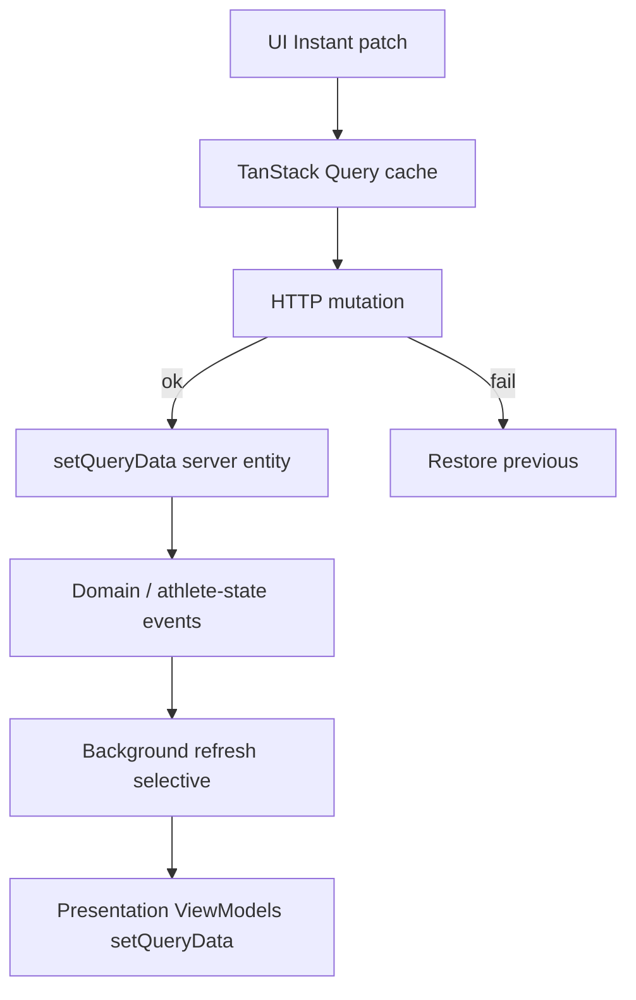

# SHARPIT — Instant UX Architecture

> **Status:** Canonical — Product Vertical (perceived performance)  
> **Phase:** Stabilization — Core frozen  
> **Scope:** Presentation / client cache / mutation UX only  
> **Non-goals:** Physiological engines · Digital Twin · Decision Engine · offline sync implementation  
> **Related:** [`EVENT_DRIVEN_ARCHITECTURE.md`](EVENT_DRIVEN_ARCHITECTURE.md) · [`PRESENTATION_LAYER_ARCHITECTURE.md`](PRESENTATION_LAYER_ARCHITECTURE.md) · [`ARCHITECTURE.md`](../ARCHITECTURE.md)

---

## 1. Mission

SHARPIT must feel like a premium native application.

The athlete should almost never feel network latency. Local cache and ViewModels are the UI source of truth; the server confirms. Blocking waits are the exception.

```
UI reacts first  →  cache / ViewModel patch  →  background sync  →  reconcile
```

This vertical does **not** add Core engines. It classifies and migrates every client interaction toward Instant / Background / Blocking.

---

## 2. Interaction taxonomy

Every user interaction belongs to exactly one class:

| Class                    | UX contract                                                                                 | When                                                                                       |
| ------------------------ | ------------------------------------------------------------------------------------------- | ------------------------------------------------------------------------------------------ |
| **Instant (optimistic)** | UI updates immediately. No spinner for the mutation itself. Subtle sync indicator optional. | Reversible writes with deterministic optimistic shape                                      |
| **Background**           | Fire-and-forget or non-blocking progress. Athlete keeps context.                            | Refresh, AI generation, provider sync, inference reconciliation                            |
| **Blocking**             | Explicit wait / dedicated progress UI. Rare.                                                | Auth, OAuth, payment, irreversible external side-effects, compute whose result _is_ the UI |

Rollback-safe optimistic updates are mandatory for Instant and SAFE_WITH_ROLLBACK mutations.

---

## 3. Architectural principles

1. **Local state is UI truth** — TanStack Query cache + Presentation ViewModels.
2. **Server confirms** — never block the paint on reversible mutations.
3. **Prefer `setQueryData` / targeted patches** over `invalidateQueries`.
4. **Invalidate only when deterministic patch is impossible** (AI payloads, provider bulk ingest, opaque server transforms).
5. **Event-driven consistency** — mutations should trigger existing athlete-state / domain events; avoid manual page reloads and cascading full-tree fetches.
6. **Offline-ready shape** — optimistic apply + rollback + eventual reconcile must remain possible; do not implement offline mutation queues yet.
7. **Core frozen** — no changes to Twin, Decision Engine, or physiological engines.

### Existing foundation (keep and extend)

| Asset                                                    | Role                                     |
| -------------------------------------------------------- | ---------------------------------------- |
| `src/lib/query/keys.ts`                                  | Canonical query keys                     |
| `src/lib/query/fetchers.ts` + `presentation-fetchers.ts` | HTTP boundary                            |
| `src/lib/query/optimistic.ts` → `listOptimistic()`       | List optimistic + rollback               |
| `usePrefetchNavQuery()`                                  | Hover / focus navigation prefetch        |
| `AthleteStateInitializer`                                | App-open background refresh + cache seed |
| `useOnlineStatus` / `useOfflineSnapshot`                 | Offline _read_ readiness (PWA snapshot)  |

### Anti-patterns to eliminate

- Waiting for `mutateAsync` before closing a dialog when the mutation is Instant
- Full-screen `"Loading…"` / `"Saving…"` for SAFE mutations
- Blanket `invalidateQueries()` with no key after reversible CRUD
- Direct `fetch` in components for mutations that belong in hooks
- Cascading invalidation of the entire presentation layer when a single list item changed

---

## 4. Query audit (GET)

Classification columns:

- **Prefetch** — should navigation prefetch this?
- **Cache** — recommended `staleTime` policy
- **SWR** — show cached data while revalidating (`keepPreviousData` / `placeholderData`)
- **BG refresh** — silent refetch / polling
- **Hydrate** — seed from sibling cache / refresh payload
- **Action** — keep · extend · fix · remove

### 4.1 Domain list & entity queries

| Query / Hook                      | Endpoint                                      | Current             | Classification                                   | Recommended action                                                                                                                                                 |
| --------------------------------- | --------------------------------------------- | ------------------- | ------------------------------------------------ | ------------------------------------------------------------------------------------------------------------------------------------------------------------------ |
| `useActivities`                   | GET `/api/activities`                         | stale 2m            | Prefetch `/seances`,`/coach` · SWR · BG on focus | **Keep.** Prefer patch on CRUD over full invalidate when possible. Training hub (`/training`) keeps chrome; value micro-skeletons on cold load only (`isPending`). |
| `useActivityStream`               | GET `/api/activities/:id/streams`             | stale ∞             | Hydrate on demand                                | **Keep.** Immutable; no spinner if cached.                                                                                                                         |
| `useMultisportStreams`            | GET `/api/activities/:id/multisport-streams`  | stale ∞             | On demand                                        | **Keep.**                                                                                                                                                          |
| `useHealthEntries`                | GET `/api/health`                             | stale 2m + previous | SWR · BG after provider sync                     | **Keep.** Prefetch on `/corps` / recovery entry.                                                                                                                   |
| `useBodyComposition`              | GET `/api/body-composition`                   | stale 2m + previous | SWR                                              | **Keep.** Prefetch `/corps`.                                                                                                                                       |
| `useGoals`                        | GET `/api/goals`                              | stale 5m            | Prefetch `/goals`,`/calendar`,`/planning`        | **Keep.** Already optimistic mutations.                                                                                                                            |
| `useGoalAchievements`             | GET `/api/goals/achievements`                 | stale 5m            | Lazy                                             | **Keep.** Prefetch when Goals tab opens.                                                                                                                           |
| `usePlannedSessions`              | GET `/api/planned-sessions`                   | stale 5m            | Prefetch many routes                             | **Keep.** Core planning cache.                                                                                                                                     |
| `usePlannedSessionPresentation`   | GET `/api/presentation/planned-session/:id`   | **stale 0**         | SWR                                              | **Fix → stale 5m.** Always-fresh causes remount jank.                                                                                                              |
| `useSessionRationalePresentation` | GET `/api/presentation/session-rationale/:id` | stale 5m            | Lazy                                             | **Keep.** Prefer null over spinner when empty.                                                                                                                     |
| `useBrickAnalysis`                | GET brick analyze                             | default             | Lazy                                             | **Keep.** Seed via `useAnalyzeBrick` `setQueryData`.                                                                                                               |
| `usePhysicalNotes`                | GET `/api/physical-notes`                     | default             | Prefetch physical hub                            | **Keep.** Already optimistic. Set explicit stale 5m.                                                                                                               |
| `useTrainingPlan`                 | GET `/api/training-plans`                     | stale 1m            | Settings / coach                                 | **Keep.**                                                                                                                                                          |
| `useRecords`                      | GET `/api/records`                            | stale 30m           | Long cache                                       | **Keep.** Patch/invalidate only after activity ingest.                                                                                                             |
| `useAthleteProfile`               | GET `/api/athlete-profile`                    | stale 5m            | Prefetch settings                                | **Keep.**                                                                                                                                                          |
| `useThresholdHistory`             | GET threshold-history                         | stale 1m            | Settings                                         | **Keep.**                                                                                                                                                          |
| `useThresholdPreview`             | GET apply-estimates preview                   | stale 5m            | Settings                                         | **Keep.**                                                                                                                                                          |
| `useGoogleEvents`                 | GET `/api/google/events`                      | stale 5m            | Calendar range                                   | **Keep.** Range-keyed; avoid refetch spam.                                                                                                                         |
| `useGoogleCalendars`              | GET `/api/google/calendars`                   | stale 5m            | Conditional                                      | **Keep.**                                                                                                                                                          |

### 4.2 Athlete state & Today

| Query / Hook         | Endpoint                          | Current                     | Classification                                      | Recommended action                                           |
| -------------------- | --------------------------------- | --------------------------- | --------------------------------------------------- | ------------------------------------------------------------ |
| `useAthleteSnapshot` | GET `/api/athlete-state/snapshot` | stale 5m + dynamic interval | Hydrate from refresh · BG poll when stale/computing | **Keep.** UI must render last snapshot; never block shell.   |
| `useToday`           | same snapshot + `select`          | stale 5m + previous         | Hydrate · SWR                                       | **Keep.** Prefer presentation Today ViewModel for dashboard. |
| `useWellnessCheckin` | GET `/api/wellness-checkin`       | stale 5m                    | Prefetch with Today                                 | **Keep.** Status only.                                       |

Dynamic polling (retain): 12s when recommendations `stale|awaiting_data|computing`; 60s on phase drift; otherwise off.

### 4.3 Presentation ViewModels

All use GET `/api/presentation/*`, typically stale 5m.

| Hook                             | Endpoint                              | Prefetch                                  | Action                                                                                                                 |
| -------------------------------- | ------------------------------------- | ----------------------------------------- | ---------------------------------------------------------------------------------------------------------------------- |
| `useTodayPresentationViewModel`  | `/presentation/today`                 | `/` · seeded by `AthleteStateInitializer` | **Keep.** Chrome stable; value micro-skeletons on `isPending` / `isPlaceholderData` (`keepPreviousData`).              |
| `useRecoveryViewModel`           | `/presentation/recovery`              | `/corps`,`/recovery`                      | **Keep.** Chrome stable; value micro-skeletons on `isPending` / `isPlaceholderData` (date change).                     |
| `useSleepViewModel`              | `/presentation/sleep`                 | `/today/sleep`                            | **Keep.** Same micro-skeleton contract.                                                                                |
| `useEffortViewModel`             | `/presentation/effort`                | `/today/effort`                           | **Keep.** Same micro-skeleton contract.                                                                                |
| `useAdaptationViewModel`         | `/presentation/adaptation`            | `/today/adaptation`                       | **Keep.** Same micro-skeleton contract.                                                                                |
| `usePhysicalHealthViewModel`     | `/presentation/physical-health`       | physical hub                              | **Keep.** Chrome stable; value micro-skeletons on `isPending` / `isPlaceholderData`.                                   |
| `useBodyPresentationViewModel`   | `/presentation/body`                  | `/biology` · composition                  | **Keep.** Same micro-skeleton contract on window change (`keepPreviousData`).                                          |
| `useProjectedAthleteViewModel`   | `/presentation/projected-athlete`     | coach / planning                          | **Keep.** Prefetch on coach route. Chrome stable; value micro-skeletons on horizon / week change (`keepPreviousData`). |
| `useScenarioComparisonViewModel` | `/presentation/scenario-comparison`   | dialog open                               | **Keep.** Prefetch on dialog intent. Same SWR contract.                                                                |
| Weekly coaching brief            | `/presentation/weekly-coaching-brief` | coach week                                | **Keep.** Skeleton only if no cache.                                                                                   |

### 4.4 Coach & memory

| Query / Hook       | Endpoint                 | Current                  | Action                                                                                                       |
| ------------------ | ------------------------ | ------------------------ | ------------------------------------------------------------------------------------------------------------ |
| `useCoachMemory`   | GET `/api/coach-memory`  | stale 30s                | **Raise to 2–5m** + optimistic mutations (see §5).                                                           |
| `useCoachContext`  | GET `/api/coach/context` | default                  | Explicit stale 5m; already patched on save.                                                                  |
| `useConversations` | GET conversations        | stale 2m                 | Prefetch `/coach`; patch list on create/rename/delete. Chrome stable; list row micro-skeletons on cold load. |
| `useConversation`  | GET conversation `:id`   | stale 1m · enabled by id | Hydrate from create; chat panel micro-skeleton (bubbles + composer) while fetching.                          |
| `useDailyBriefing` | GET briefing             | default                  | Background generation; show prior if any.                                                                    |
| `useWeeklyReview`  | GET weekly-review        | default                  | Same as briefing.                                                                                            |

### 4.5 Background / non-navigation GETs

| Call site               | Endpoint                  | Class      | Notes                                                           |
| ----------------------- | ------------------------- | ---------- | --------------------------------------------------------------- |
| Geocoding home / search | GET geocoding             | Background | Typeahead — never block form open.                              |
| Weather preview         | POST weather-preview      | Background | Preview only; not a persistence mutation.                       |
| Travel context read     | GET `/api/travel-context` | Background | Prefer React Query key `travelContext` instead of ad-hoc fetch. |
| Narrative poll          | GET activity by id        | Background | Soft polling until narrative ready.                             |
| Dev / cron / inspect    | various                   | N/A        | Out of Instant UX product surface.                              |

### 4.6 Query strategy rules (target)

1. **Cold start only** may show skeletons (`isPending && data == null`).
2. **Refetch** must never blank the UI (`isFetching && data` → subtle sync only).
3. Prefetch every primary nav target via `usePrefetchNavQuery` (extend `/corps` body, coach conversations, physical notes).
4. Reuse ViewModels from `AthleteStateInitializer` / refresh payload whenever present.
5. Prefer **stale-while-revalidate** for all presentation GETs (minimum stale 5m except immutable streams).
6. **Route `loading.tsx` must be segment-scoped.** Never put a hub-specific skeleton at `(app)/loading.tsx` — that Suspense boundary wraps every nested route and can flash Today chrome on hard refresh of `/coach`, `/training`, etc. Today lives under `(app)/(home)/loading.tsx` (route group); other hubs keep their own `loading.tsx`.

---

## 5. Mutation audit (POST / PATCH / DELETE)

Classes:

- **SAFE** — Instant optimistic
- **SAFE_WITH_ROLLBACK** — Instant optimistic + mandatory rollback
- **BACKGROUND** — non-blocking; progress optional
- **BLOCKING** — must wait for server

### 5.1 Already Instant (keep; harden)

| Mutation                                         | Method            | Endpoint                 | Class                     | Cache strategy today                                       | Gap                                                                                           |
| ------------------------------------------------ | ----------------- | ------------------------ | ------------------------- | ---------------------------------------------------------- | --------------------------------------------------------------------------------------------- |
| Goal create / update / delete                    | POST/PATCH/DELETE | `/api/goals`             | SAFE / SAFE_WITH_ROLLBACK | `listOptimistic` + invalidate on settle                    | Prefer `setQueryData` with server entity on success; invalidate achievements only when needed |
| Planned session create / brick / update / delete | POST/PATCH/DELETE | `/api/planned-sessions*` | SAFE / SAFE_WITH_ROLLBACK | `listOptimistic`                                           | Same; patch presentation VM when shape known                                                  |
| Physical note CRUD + checkin                     | POST/PATCH/DELETE | `/api/physical-notes*`   | SAFE / SAFE_WITH_ROLLBACK | `listOptimistic`                                           | **Keep.**                                                                                     |
| Coach context save                               | POST              | `/api/coach/context`     | SAFE                      | `setQueryData` context + memory                            | Close to ideal — make Instant (no save spinner if avoidable)                                  |
| Conversation create                              | POST              | conversations            | SAFE                      | `setQueryData` + invalidate list                           | Drop redundant invalidate; patch only                                                         |
| Conversation save / rename                       | PATCH             | conversation             | SAFE                      | set + invalidate                                           | Patch list title locally                                                                      |
| Conversation delete                              | DELETE            | conversation             | SAFE_WITH_ROLLBACK        | removeQueries + invalidate                                 | Optimistic remove from list                                                                   |
| Briefing generate                                | POST              | `/api/coach/briefing`    | BACKGROUND                | `setQueryData` on success                                  | Keep Background; do not block Today                                                           |
| Weekly review generate                           | POST              | weekly-review            | BACKGROUND                | `setQueryData`                                             | Same                                                                                          |
| Brick analyze                                    | POST              | brick/analyze            | BACKGROUND                | `setQueryData`                                             | Progress in panel only                                                                        |
| Wellness submit                                  | POST              | `/api/wellness-checkin`  | SAFE → Instant            | set completed + **invalidate** today/snapshot/presentation | **Migrate:** optimistic completed + soft BG refresh; avoid waiting on inference               |

### 5.2 Not Instant yet — migrate

| Mutation                       | Method            | Endpoint               | Target class                   | Current UX                                         | Migration                                                                                                                       |
| ------------------------------ | ----------------- | ---------------------- | ------------------------------ | -------------------------------------------------- | ------------------------------------------------------------------------------------------------------------------------------- |
| Activity create / update       | POST/PATCH        | `/api/activities`      | SAFE                           | Form waits on fetch; invalidate activities+records | Move to hook + `listOptimistic` / entity patch; close dialog Instant                                                            |
| Activity delete                | DELETE            | `/api/activities/:id`  | SAFE_WITH_ROLLBACK             | Ad-hoc fetch in `activity-list`                    | Hook + optimistic remove + rollback                                                                                             |
| Coach memory travel CRUD       | POST/PATCH/DELETE | `/api/coach-memory*`   | SAFE / SAFE_WITH_ROLLBACK      | Wait + cascade invalidate memory/travel/sessions   | `listOptimistic` on `entries`; patch travel banner; **background** invalidate planned sessions only if `applyToPlannedSessions` |
| Travel context delete (banner) | DELETE            | coach-memory `:id`     | SAFE_WITH_ROLLBACK             | Ad-hoc fetch + invalidate                          | Reuse coach-memory remove mutation                                                                                              |
| Athlete profile PATCH          | PATCH             | `/api/athlete-profile` | SAFE                           | Waits + broad invalidate                           | Optimistic patch profile cache; targeted invalidate streams/history                                                             |
| Apply threshold estimates      | POST              | apply-estimates        | SAFE_WITH_ROLLBACK / BLOCKING* | Button spinner                                     | Prefer optimistic profile numbers from preview; rollback on reject. *Block only if preview missing.                             |
| Google calendar visibility     | POST              | calendar-visibility    | SAFE                           | Await + invalidate events                          | Optimistic calendar flags; BG refetch events                                                                                    |
| Google select calendar         | POST              | select-calendar        | SAFE                           | Await                                              | Optimistic selected id                                                                                                          |
| Training plan archive          | DELETE            | training-plans `:id`   | SAFE_WITH_ROLLBACK             | Invalidate only                                    | Optimistic clear/archive flag                                                                                                   |
| Planned session link           | POST              | `:id/link`             | SAFE (partial)                 | Invalidate + chain analyze                         | Optimistic `activityId` patch; analyze remains BACKGROUND                                                                       |
| Session analyze                | POST              | `:id/analyze`          | BACKGROUND                     | Spinner / poll                                     | Keep Background; never block navigation                                                                                         |

\* Threshold apply: Instant if preview payload already in cache; otherwise short Blocking on preview fetch only.

### 5.3 Background (non-blocking) — keep as Background

| Mutation                                             | Endpoint                          | UX                                                        |
| ---------------------------------------------------- | --------------------------------- | --------------------------------------------------------- |
| `AthleteStateInitializer` refresh                    | POST `/api/athlete-state/refresh` | Silent; seeds snapshot + Today presentation               |
| Provider sync (Strava/Garmin/Withings/Renpho/Google) | POST `/*/sync`                    | Subtle syncing; invalidate domain caches after completion |
| Sync all                                             | settings hub                      | Same                                                      |
| Coach plan generate                                  | POST `/api/coach/plan`            | Progress in panel; result is the UI                       |
| Coach plan adapt                                     | POST `/api/coach/adapt`           | Same                                                      |
| Training plan generate                               | POST `/api/training-plans`        | Same                                                      |
| Garmin profile import                                | POST import-garmin                | Progress in settings                                      |
| Weather preview                                      | POST weather-preview              | Non-persistent                                            |
| Narrative / briefing background jobs                 | server fire-and-forget            | Poll or soft refresh                                      |

### 5.4 Blocking (remain rare)

| Interaction                                                                                                | Why blocking                                                                                                                          |
| ---------------------------------------------------------------------------------------------------------- | ------------------------------------------------------------------------------------------------------------------------------------- |
| Clerk authentication / session                                                                             | Identity — no fake success                                                                                                            |
| Provider OAuth connect (redirect)                                                                          | External consent                                                                                                                      |
| Provider disconnect                                                                                        | External revocation; confirm then wait                                                                                                |
| Payment (future)                                                                                           | Financial confirmation                                                                                                                |
| Destructive maintenance (`invalidateQueries()` all / wipe)                                                 | Irreversible ops tooling                                                                                                              |
| Accepting AI plan into calendar _as a batch apply_ when server assigns real IDs and side-effects are large | Prefer Instant per-session insert when using existing planned-session optimistic create; block only for single-shot opaque batch APIs |

Everything else must move out of Blocking.

---

## 6. Optimistic strategy

### 6.1 Standard lifecycle

```
onMutate:
  cancelQueries(affected keys)
  snapshot previous cache
  setQueryData(optimistic patch)
  return { previous }

onError:
  restore previous
  toast error (rollback notice)

onSuccess:
  setQueryData(server entity) when shape known  // preferred
  optional quiet success toast

onSettled:
  targeted invalidate ONLY if server may have derived fields
  else no-op
```

### 6.2 Helpers

| Helper                        | Use                                                                           |
| ----------------------------- | ----------------------------------------------------------------------------- |
| `listOptimistic()`            | List CRUD (goals, sessions, physical notes, coach memory entries, activities) |
| `tempId()` / `isTempId()`     | Client ids until server returns                                               |
| Future: `entityOptimistic()`  | Single-object caches (profile, wellness status, conversation)                 |
| Future: `patchPresentation()` | Lightweight ViewModel field patches when domain event does not recompute      |

### 6.3 Dialog / form contract

- Close or advance UI in `onMutate` (or immediately after calling `mutate`, not `await mutateAsync`) for Instant mutations.
- Disable duplicate submit via in-flight guard, not by freezing the whole screen.
- Never show `"Saving…"` as primary feedback for Instant mutations.

---

## 7. Rollback strategy

1. Always capture `previous` query snapshots before patch.
2. Restore on error; never leave temp entities on failure.
3. If multiple keys patched (e.g. memory + travel banner), restore **all** or none.
4. Toast must state that nothing was saved (existing `listOptimistic` copy).
5. After rollback, do **not** immediately invalidate unless needed to repair a torn cache.
6. Server validation errors (Zod) → rollback + field-level message when available.

---

## 8. Cache update strategy

### 8.1 Preference order

1. `setQueryData` with server response entity
2. Functional `setQueryData` patch
3. `setQueriesData` for related keys sharing a field
4. Targeted `invalidateQueries({ queryKey })`
5. Broad invalidation — last resort (provider sync, maintenance)

### 8.2 Replace common cascades

| Trigger                               | Today                                        | Target                                                                                          |
| ------------------------------------- | -------------------------------------------- | ----------------------------------------------------------------------------------------------- |
| Goal / session / physical CRUD settle | invalidate list                              | `setQueryData` server entity; invalidate only derived aggregates                                |
| Wellness success                      | invalidate today + snapshot + presentation   | set wellness completed; **background** `athlete-state/refresh` or soft invalidate snapshot only |
| Coach memory CRUD                     | invalidate memory + travel + plannedSessions | optimistic memory; invalidate plannedSessions **iff** apply-to-sessions                         |
| Activity save                         | invalidate activities + records              | optimistic activities; BG invalidate records                                                    |
| Profile save                          | invalidate streams + history + profile       | patch profile; invalidate streams only if thresholds changed                                    |
| Conversation mutations                | set + invalidate list                        | set only                                                                                        |

### 8.3 Presentation layer

- Do not recompute Twin/Decision on the client.
- After domain mutations that affect Today, prefer:
  1. Keep showing current ViewModel
  2. Background refresh snapshot / presentation
  3. Swap ViewModel when ready (`setQueryData`)
- Avoid blanking presentation queries during refetch.

---

## 9. Background synchronization strategy



Align with [`EVENT_DRIVEN_ARCHITECTURE.md`](EVENT_DRIVEN_ARCHITECTURE.md):

- App open → `AthleteStateInitializer` (already Instant-read + BG refresh)
- Provider sync completed → targeted domain invalidation + snapshot soft refresh
- Observation ingested → existing orchestrator; UI polls freshness, does not block
- Wellness / manual activity → optimistic local + BG inference refresh

**Syncing indicator:** use freshness (`syncing` / `computing`) and/or a thin global `isMutating` / `isFetching` affordance — never a full-page `"Refreshing…"`.

---

## 10. Remaining blocking operations

Explicit allow-list:

1. Authentication (Clerk)
2. OAuth connect redirects (Strava, Garmin, Withings, Renpho, Google)
3. Provider disconnect confirmation + await
4. Future payment / subscription
5. Irreversible admin/maintenance wipes
6. AI generation panels **only while the generated artifact is the product** (plan/adapt/briefing first paint) — still non-navigational Blocking (panel-local), not app-shell Blocking

All CRUD above §5.2 must leave this list.

---

## 11. Perceived performance checklist

| Before                                                | After                                       |
| ----------------------------------------------------- | ------------------------------------------- |
| `"Loading…"` on nav with warm cache                   | Instant paint from cache / prefetch         |
| `"Saving…"` on goal/session/note                      | Instant list update                         |
| Dialog awaits `mutateAsync`                           | Dialog closes on mutate                     |
| Full invalidate after CRUD                            | Targeted `setQueryData`                     |
| Wellness waits inference                              | Mark complete Instant; Twin refreshes in BG |
| Remount planned-session presentation (`staleTime: 0`) | Cached 5m SWR                               |
| Ad-hoc `fetch` deletes                                | Hook + rollback                             |

---

## 12. Future offline compatibility (no implementation yet)

Do **not** build an offline mutation queue in this sprint. Do preserve:

| Choice                                        | Offline-ready?                                          |
| --------------------------------------------- | ------------------------------------------------------- |
| Optimistic apply + rollback contexts          | Yes — queue can replay same apply functions             |
| Temp ids (`optimistic-*`)                     | Yes — map to server ids on ack                          |
| `listOptimistic` centralized helper           | Yes — extend to persisted outbox later                  |
| Ad-hoc component `fetch` mutations            | **No** — migrate into hooks first                       |
| Relying only on `invalidateQueries` for truth | Weak — prefer explicit patches that can be journaled    |
| PWA `useOfflineSnapshot` read path            | Already supports offline _read_ of last Twin expression |

When offline sync is later approved: outbox of `{ mutationKey, vars, apply, rollback }` drained on `online`, reconciled via existing event-driven refresh.

---

## 13. Migration backlog (execution order)

Ordered for max athlete-visible gain without touching Core.

Status legend: ✅ done in Instant UX vertical · ⏳ remaining polish

| #   | Work item                                                                      | Class impact    | Status |
| --- | ------------------------------------------------------------------------------ | --------------- | ------ |
| 1   | Fix `usePlannedSessionPresentation` `staleTime: 0 → 5m`                        | Query           | ✅     |
| 2   | Activity CRUD → hooks + optimistic                                             | SAFE / rollback | ✅     |
| 3   | Coach memory mutations → optimistic + conditional session invalidate           | SAFE            | ✅     |
| 4   | Wellness Instant complete + BG snapshot refresh                                | SAFE            | ✅     |
| 5   | Harden `listOptimistic` success path: `reconcile` + optional settle invalidate | Cache           | ✅     |
| 6   | Profile PATCH optimistic                                                       | SAFE            | ✅     |
| 7   | Session `link` optimistic activityId                                           | SAFE            | ✅     |
| 8   | Google calendar visibility (already optimistic) + non-blocking events refresh  | SAFE            | ✅     |
| 9   | Expand prefetch map (body, physical notes, conversations, training)            | Query           | ✅     |
| 10  | Replace dialog `await mutateAsync` Instant paths (goals, sessions)             | UX              | ✅     |
| 11  | Subtle global syncing indicator                                                | UX              | ✅     |
| 12  | Travel banner uses shared mutation hook                                        | Consistency     | ✅     |
| 13  | Conversation list: remove redundant invalidates + optimistic rename/delete     | Cache           | ✅     |
| 14  | Raise `useCoachMemory` staleTime                                               | Query           | ✅     |

**Done when:** every row in §4 and §5 has a final class, and no SAFE mutation shows a blocking spinner as primary feedback.

Remaining polish (non-blocking): Google select-calendar optimistic; training-plan archive optimistic; threshold-apply Instant from preview cache; further dialogs still using `mutateAsync` outside goals/sessions/activities.
---

## 14. Success criteria

- Navigation rarely shows cold skeletons when prefetch/cache warm.
- Mutations feel immediate; network is an implementation detail.
- Rollback is safe and visible on failure.
- Event-driven athlete-state refresh remains the reconciliation path.
- Core engines, Digital Twin, and Decision Engine untouched.
- Architecture remains compatible with a future offline outbox.

---

## 15. Inventory snapshot (baseline 2026-07-17)

| Surface                                  | Count (approx.)                                                                                  |
| ---------------------------------------- | ------------------------------------------------------------------------------------------------ |
| API route handlers                       | ~85                                                                                              |
| Query key factories                      | 36                                                                                               |
| Query hooks                              | ~25+                                                                                             |
| Mutation hooks / call sites              | ~30+                                                                                             |
| Mutations already using `listOptimistic` | Goals, planned sessions, physical notes                                                          |
| Primary gaps                             | Activities, coach memory, wellness cascade, profile, ad-hoc fetches, `staleTime: 0` presentation |

This document is the constitution for the Instant UX vertical. Implementation follows §13 without expanding Core scope.
