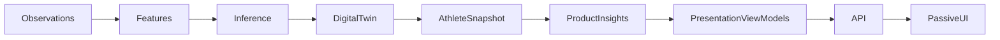

# Presentation Layer Architecture

## Objectif

Introduire une couche de **Presentation Layer** côté serveur au-dessus de `Product Insights` afin de produire des **ViewModels** prêts à rendre côté UI.

L’objectif produit est double :

1. **Déplacer l’assemblage produit hors du client** (mapping, sélection, hiérarchisation, séries/labels).
2. **Rendre les composants React passifs** : ils reçoivent un ViewModel sérialisable et ne font plus de logique métier.

## Chaîne d’exécution (cible)



## Définition

- `ProductInsight` : interprétation déterministe d’un ou plusieurs champs `AthleteSnapshot` (déjà en place).
- `Presentation ViewModel` : contrat de surface sérialisable qui contient _tout_ ce qui est nécessaire au rendu (hiérarchie, sections, charts, labels, actions, navigation, empty states, confidence presentation, …).
- La UI rend uniquement ces ViewModels.

## Règles de passivité UI

1. Les composants React (et les `*PageView` de rendu) ne doivent pas :
   - calculer des scores / séries,
   - décider de la sémantique (choix d’insights, traduction métier, verdict logic),
   - reconstruire la hiérarchie.
2. Ils peuvent :
   - conditionner le rendu sur des champs **déjà calculés** dans le ViewModel,
   - exécuter des interactions purement UI (ouvrir une modale, changer une tab locale),
   - appeler des endpoints de présentation uniquement pour récupérer un ViewModel (pas pour recalculer).

## Contrats (ViewModels)

Les contrats canonique sont ajoutés sous `src/core/presentation/` :

- `src/core/presentation/types.ts` : types transverses (navigation, confidence, empty state, sections).
- `src/core/presentation/*-view-model.ts` : view model par surface (`today`, `recovery`, `sleep`, `effort`, `adaptation`, `body`).

## Projection serveur

Les assembleurs serveur vivent dans `src/lib/presentation/`.
Ils ont deux responsabilités :

1. Lire `AthleteSnapshot` (via `getOrBuildAthleteSnapshot`).
2. Produire un ViewModel sérialisable en combinant :
   - `Product Insights`,
   - les données “secondaires” nécessaires au rendu (health entries, activities, planned sessions, body composition, …).

## API de présentation

Endpoints par surface (recommandé, en parallèle du legacy) :

- `/api/presentation/today`
- `/api/presentation/recovery`
- `/api/presentation/sleep`
- `/api/presentation/effort`
- `/api/presentation/adaptation`
- `/api/presentation/body`

Les payloads retournent des objets `{ viewModel: ... }`.

## Migration (stratégie)

Migration progressive, surface par surface, avec objectif final :

- une **UI passive** qui ne fait que fetch/cache/retry + rendu.

Ondes (mêmes principes que dans le plan produit) :

1. **Recovery / Sleep / Effort / Adaptation** : déplacer la logique de projection depuis les routes/pages clientes vers le serveur.
2. **Today** : déplacer l’assemblage du Dashboard.
3. **Body** : déplacer la construction des séries, tendances et insights (en précomputant par fenêtre ou en supportant des paramètres de récupération).
4. Nettoyage : supprimer progressivement l’assemblage métier client et les hooks “smart”.

## Etat actuel (post-stabilization P2)

- Contrats transverses `src/core/presentation/types.ts` et view models par surface.
- Projections serveur + endpoints pour toutes les surfaces drill-down et Today.
- Client canonique : `GET /api/athlete-state/snapshot` (`useToday`) + fetchers `/api/presentation/*`.
- Legacy routes supprimées : `/api/reasoning`, `/api/today`, `/api/recovery`, `/api/fatigue`, `/api/adaptation`.
- Global Decision Strip sur les drill-downs (verdict produit depuis `snapshot.decision`).

## Prochaines étapes (P3+)

## Architecture Boundary + Guard CI (permanent)

### Canonical product read path

All product verdicts, recommendations, limiting factors, and confidence gating must flow through:

```
DecisionState → src/lib/decision/projection.ts → Presentation ViewModels → Passive UI
```

Forbidden in presentation layers (`src/components/**`, `src/hooks/**`, `src/lib/presentation/**`):

- `pickRecommendation`, `buildWhyEvidence`, `resolveConfidenceHref`, `resolveLimitingFactorHref`
- Reading `reasoning.overallVerdict`, `reasoning.topAction`, or `reasoning.keyFindings` for product decisions
- `isAdviceActionable(reasoning)` — use `isAdviceActionableFromDecision(decision)`

Enforced by:

- Import guard: `src/core/architecture/__tests__/presentation-architecture-guard.test.ts`
- Legacy pattern guard (same file, P2): scans for deprecated identifiers and reasoning verdict reads

### Contrat de passivité côté React

Responsabilités interdites :

- Les composants React (et pages de rendu) ne doivent jamais :
  - interpréter des métriques physiologiques ;
  - générer des `Product Insights` ;
  - calculer des décisions athlete ;
  - dériver des recommandations ;
  - calculer la `confidence` ;
  - mapper des valeurs physiologiques vers du sens produit (verdicts, libellés de décision, hiérarchie produit, etc.) ;
  - assembler la hiérarchie produit (sections/ordre/“primary vs supporting vs contextual”) ;
  - appliquer des règles business métier.

Responsabilités autorisées :

- Rendre (render) uniquement ;
- gérer l’état UI local (modales, tabs, sélection locale) ;
- gérer les interactions UI ;
- appeler des hooks ;
- dispatcher des actions (côté client).

### Directions de dépendances autorisées (aucune dépendance inverse)

La direction autorisée est :

```mermaid
flowchart LR
  ui[Presentation Components/Pages] --> hooks[Presentation Hooks]
  hooks --> api[Presentation API / Fetchers]
  api --> pl[Presentation Layer (ViewModels serveur)]
  pl --> pil[Product Insight Layer]
  pil --> snap[Snapshot]
  snap --> inf[Inference]
```

Règle :

- Reverse dependencies interdites : les composants/pages (UI passive) ne doivent pas importer directement `Inference`, `DigitalTwin`, `Feature Engine`, `Observation Engine`, ni des modules de “Product Insight builders”.

### Guard CI (Vitest + AST imports)

Un garde-fou permanent existe via Vitest :

- fichier: `src/core/architecture/__tests__/presentation-architecture-guard.test.ts`
- mécanisme: inspection AST des imports
- périmètre: `src/components/**`, `src/hooks/**`, `src/app/**` (exclut `src/app/api/**`)

La CI doit échouer si un fichier de présentation importe une **import de valeur** (au runtime) depuis l’une des couches interdites ci-dessous.

Exception :

- Les imports `import type ...` (ou équivalents “type-only”) sont autorisés.

Imports interdits (imports de valeur uniquement) :

- `@/core/inference/**`
- `@/core/digital-twin/**`
- `@/core/features/**` (Feature Engine)
- `@/core/observation/**` (Observation Engine)
- `@/lib/engines/**` (singletons/engines)
- `@/core/product-insight/**` sauf `@/core/product-insight/types`
- `@/lib/product-insight/**`

Workflow CI :

- fichier: `.github/workflows/presentation-architecture-guard.yml`
- exécute `yarn install --immutable` puis `yarn test`

### Rappel sur la traversée de frontière

- Seuls les `Presentation ViewModels` (contrats sous `src/core/presentation/**`) sont autorisés comme surface de traversée vers l’UI.
- Toute logique physiologique, décisionnelle, de mapping vers du sens produit, d’inférence, ou de business rules doit rester en dessous (Presentation Layer serveur puis couches métier) ; l’UI reste passive pour la durée de vie de SHARPIT.
